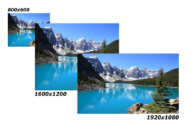
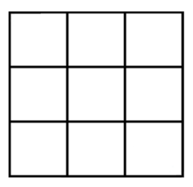

# Generar Hologramas

Proyecto desarrollado con [OpenCV para Python](https://opencv-python-tutroals.readthedocs.io/en/latest/).

Para correr el proyecto, descargue el archivo o *clonelo*. 

# Requisitos

* [Python 3 o mayor](https://www.python.org/download/releases/3.0/)
* [OpenCV](https://pypi.org/project/opencv-python/)
* [Numpy](http://www.numpy.org/)

# Esquema general del proyecto

1. Especificar el nombre del archivo de entrada, salida y dimension del video de salida 


2. Redimensionar el video de entrada


 

3. Creacion de frame de video



   
4. Procesamiento para creacion del holograma 


# Descripcion

Un holograma es una imagen en tres dimensiones resultado de la holografia. Existen diversos metodos para su creacion, en este proyecto nos enfocaremos en la creación de video para hologramas en 3d utilizando una pirámide.

# Como correr el Script? (HowTo)

El script `proyecto.py` recibe parametros que son especificados con varios `flags`:

* `-i` o `--video_in` especifica el *path* al archivo de video de entrada. Si este no existe, se presentara el error.
* `-o` o `--video_output` especifica el *path* del archivo de video, los formatos de salida deberan ser *mp4*, *avi* o *wmv*.
* `-s` o `--size` recibe un entero que especificara las dimensiones del video de salida. El video tiene dimensiones cuadradas por lo que se necesita solo una dimension.
* `-h` o `--help` mostrara mensaje de ayuda al usuario.

Como ejemplo:

``` python
    python proyecto.py -i video_ex.mp4 -o out.avi -s 480
```

# Desarrollado por
* Geancarlo Murillo
* Luis Ortiz

> ESPOL 2018 - PROCESAMIENTO DIGITAL DE IMAGENES
